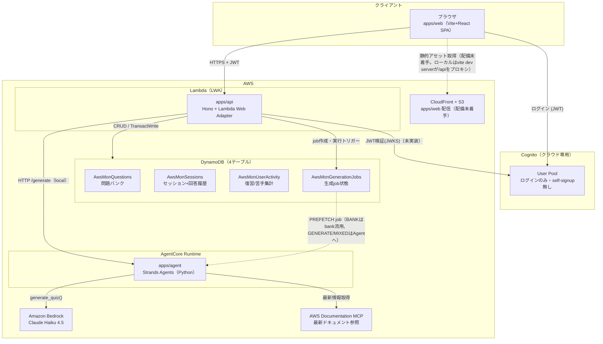
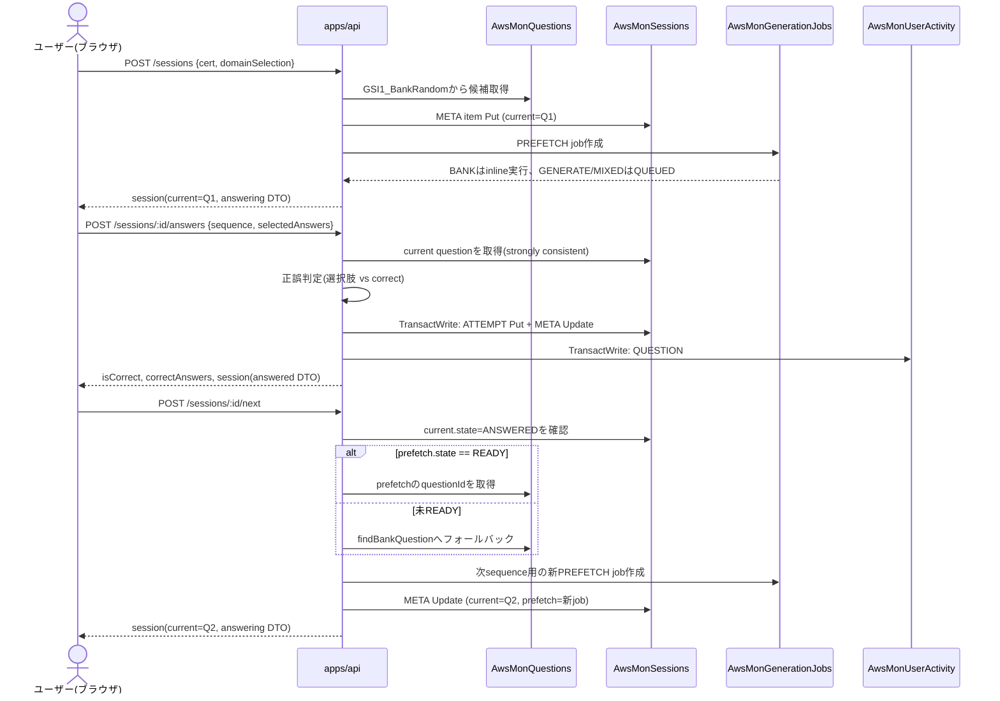
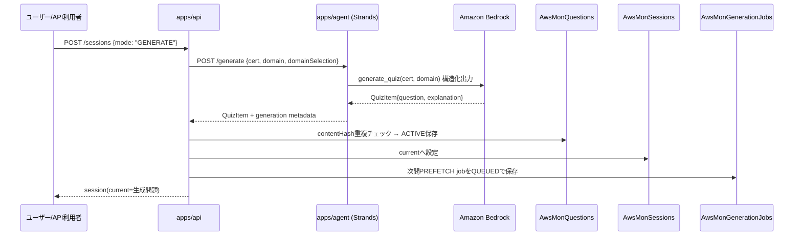
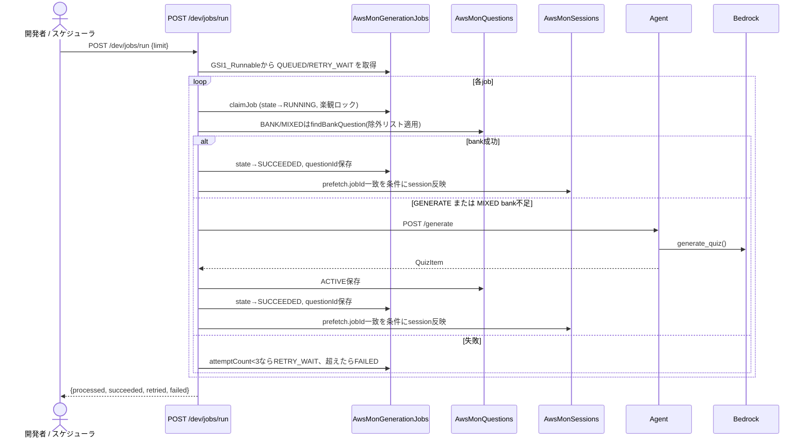

# architecture — システム構成とフロー（完全版）

最終更新: 2026-07-02

`README.md` が概要、`docs/data-model.md` がDynamoDB設計の詳細。本書は **コンポーネント間の関係** と **代表的なリクエストフロー** を図で示す完全版。個々の決定の背景は `docs/adr/` を参照。

## 全体構成図

### コンポーネント表

| コンポーネント | 技術 | 実行/配信場所 | 状態 |
|---|---|---|---|
| `apps/web` | Vite + React + TS | S3 + CloudFront | 主要画面(資格選択/出題/解説/セッション再開/復習リスト)を実装済み。Cognito接続は未着手。ローカルは vite dev server(:5173) が `/api` を api(:8080) にプロキシ |
| `apps/api` | Hono + Lambda Web Adapter (TS) | Lambda | セッション/回答/次問/一覧/dev用endpoint、agent HTTP連携を実装済み |
| `apps/agent` | Strands Agents + Bedrock (Python) | AgentCore Runtime | CLI + local HTTP server (`/health`, `/generate`) を実装済み。既定モデルは `us.anthropic.claude-haiku-4-5-20251001-v1:0` |
| `packages/shared` | TS型 + テーブル定義 | web/apiがimport | 実装済み |
| DynamoDB | 4テーブル構成 | AWS / DynamoDB Local | テーブル定義確定、Terraform適用可能 |
| 認証 | Cognito User Pool | AWS | クラウド専用。ローカルは `x-dev-user-id` devシムで代替（[ADR 0006](adr/0006-auth-cognito-cloud-only.md)） |
| IaC | Terraform | — | `infra/envs/{local,prod}` |

**ローカルとクラウドの差はほぼ認証のみ**（[ADR 0004](adr/0004-local-first-dev.md)）。`apps/api` はLWA前提で書かれているため、ローカルでは普通のNode Webサーバとして起動し、DynamoDB LocalとLocalStack（`ssm,secretsmanager,s3`のみ、`cognito-idp`は含まない）に接続する。Bedrock/AgentCore Runtimeだけはローカルで再現せず、ロジックはローカル、観測は実AWS、と役割分担する。

## リクエストフロー

### 1. セッション開始 〜 回答 〜 次の問題へ（現状の実装）

- 回答判定は常にAPI側で行い、`correct`はクライアントへ返さない（answering DTO）。回答後のレスポンスのみ`correct`/`explanation`を含む（answered DTO）。
- 不正解の回答は、同じTransactWrite内の`QUESTION#` Updateで自動的に復習リストへ入る（`reviewMarked=true` + `GSI1_ReviewList`キー設定。正解時は既存マークに触らない。解除は`PUT /reviews/:questionId`で手動）。
- `/sessions/:id/answers` と `/sessions/:id/next` はどちらも `version`（楽観ロック）と `userId` 一致をDynamoDBの`ConditionExpression`で強制する。
- job作成とsession更新は非トランザクション。`nextSessionQuestion`側の楽観ロックが競合すると作成済みjobが孤立し得る。BANKモードは読み取り専用のため実害なしだが、GENERATE/MIXEDの孤立jobは`/dev/jobs/run`にいずれ拾われて実行されるため、誰も使わない問題のためにBedrock課金が発生し得る（`apps/api/src/jobRepository.ts`のコメント参照）。

### 2. 問題生成（API -> agent HTTP）

ローカルでは `python3 -m quiz_agent.server` が `POST /generate` を提供し、`apps/api` は `AGENT_BASE_URL` 経由で呼び出す。`mode=GENERATE` は常にagent生成、`mode=MIXED` はbankを優先し候補がない場合だけagent生成にフォールバックする。コスト抑制のため、`GENERATE/MIXED` のPREFETCH jobは作成直後にinline実行せず、`POST /dev/jobs/run` で明示的に処理する。

### 3. 開発用workerによるjob処理（`/dev/jobs/run`）

`BANK` のPREFETCH jobは同一リクエスト内でinline実行される。`GENERATE/MIXED` は不要なBedrock呼び出しを避けるためQUEUEDのまま保存し、`/dev/jobs/run`で明示的に実行する。このendpointはローカル/簡易worker用で、将来SQSやAgentCore Runtime連携に置き換える余地を残す。

## データフローの原則（実装との対応）

- 問題本文はセッションに埋め込まず`questionId`参照のみ保持する。source of truthは`AwsMonQuestions`（`apps/api/src/questionBankRepository.ts`の`getQuestion`）。
- 未回答の問題を返すAPIは必ず`toQuestionDto(item, visibility)`を通し、`answering`時は`correct`/`explanation`を落とす（`packages/shared`）。
- 先読みは`Session.prefetch`に問題本体を埋め込まず、`GenerationJob`と`questionId`参照で表現する（`apps/api/src/jobRepository.ts`の`reflectJobOnSession`）。
- 認証は本番Cognito JWT前提で設計されているが、JWT検証ミドルウェアは未実装。現状は全endpointが`x-dev-user-id`ヘッダ（無ければ`dev-user`）で`userId`を決定する（`apps/api/src/http.ts`の`devUserId`）。**クラウド配備前に必ず実装すること**（[ADR 0006](adr/0006-auth-cognito-cloud-only.md)のセキュリティ上の必須事項）。

## 未実装・今後の接続ポイント

| 項目 | 現状 | 対応するADR/設計 |
|---|---|---|
| JWT検証ミドルウェア | 未実装。devシムのみ | [ADR 0006](adr/0006-auth-cognito-cloud-only.md) |
| agent ⇄ API の生成連携 | local HTTP境界で実装済み。クラウドではAgentCore Runtime呼び出しへ差し替え予定 | `docs/data-model.md` 実装順序 |
| spaced repetition（復習期限） | 未実装。`GSI2_DueList` の属性予約のみ（復習マーク/一覧のAP-06/07は実装済み: `/reviews`） | `docs/data-model.md` |
| `apps/web` のS3+CloudFront配備 | ローカルのみ（vite dev server） | フェーズ4 |
| stale化 / abandoned化 job | 未実装（GSI設計のみ存在） | `docs/data-model.md` AP-08, AP-12 |
| `ops/`（readonlyポリシー・スケジューラ） | 未着手 | [ADR 0003](adr/0003-monorepo-and-terraform-envs.md) |
| `.claude/skills/`（監視・issue発行） | 未着手 | [ADR 0003](adr/0003-monorepo-and-terraform-envs.md) |
