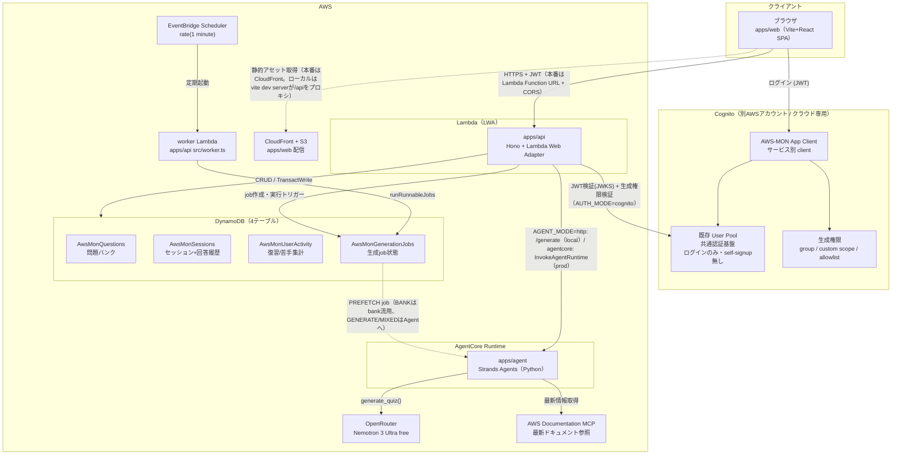
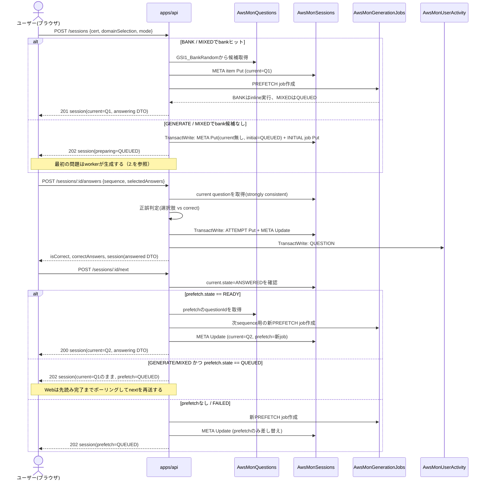
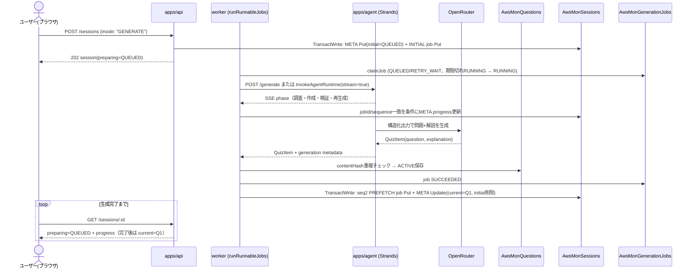
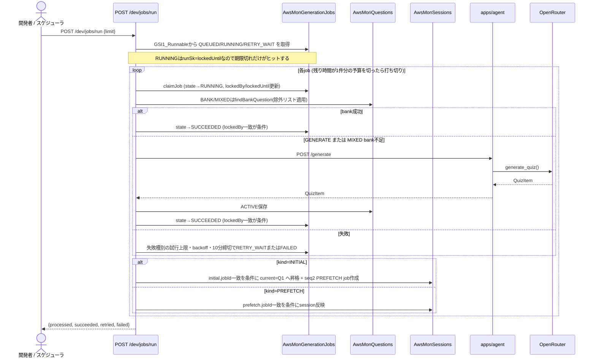

# architecture — システム構成とフロー（完全版）

最終更新: 2026-08-04

`README.md` は概要、`docs/data-model.md` はDynamoDB設計の詳細を示す。本書は **コンポーネント間の関係** と **代表的なリクエストフロー** を図で示す完全版である。個々の決定の背景は `docs/adr/` を参照。

## 全体構成図

### コンポーネント表

| コンポーネント | 技術 | 実行/配信場所 | 状態 |
|---|---|---|---|
| `apps/web` | Vite + React + TS | S3 + CloudFront | 主要画面（資格選択/出題/解説/セッション再開・削除/問題リスト/復習リスト）を実装済み。セッション削除時は、キーボード操作可能な確認ダイアログを挟む。問題リストでは、資格・AIPドメインをURL queryに保持し、一覧から詳細を遅延取得する。Cognitoログインには自前フォーム+SRP（`amazon-cognito-identity-js`、`VITE_AUTH_MODE=cognito`）を使用。ローカルでは、vite dev server（:5173）が `/api` を api（:8080）にプロキシ |
| `apps/api` | Hono + Lambda Web Adapter (TS) | Lambda | セッション開始・取得・一覧・削除（`DELETE /sessions/:id`）、回答、次問、問題一覧（`GET /questions`）、dev用endpoint、agent HTTP連携、認証・生成権限（`src/auth.ts`）を実装済み |
| `apps/agent` | Strands Agents + OpenRouter / Bedrock (Python) | AgentCore Runtime | CLI + local HTTP server (`/health`, `/generate`) を実装済み。AWSドキュメントMCPで調査してから生成（調査失敗時のみ調査なしへフォールバック）。既定はOpenRouter（`inclusionai/ling-3.0-flash:free`、[ADR 0016](adr/0016-generation-model-selection.md)）で、`AGENT_MODEL_PROVIDER=bedrock` によりBedrockへ切り替え可。オブザーバビリティ（OTel/ADOT計装・Guardrailsグラウンディングゲート）も実装し、ライブ確認済み（[ADR 0007](adr/0007-observability-stack.md)。AgentCore Evaluationsオンライン評価は検証後に [ADR 0011](adr/0011-retire-online-evaluations.md) で廃止） |
| `packages/shared` | TS型 + テーブル定義 | web/apiがimport | 実装済み |
| DynamoDB | 4テーブル構成 | AWS / DynamoDB Local | テーブル定義確定。prod（`aws-mon-prod-*`）・localともTerraform適用済み |
| 認証/認可 | 既存 Cognito User Pool + AWS-MON App Client | 別AWSアカウント / AWS | User Pool は共通。登録済みユーザーは `BANK` 出題可、LLM呼び出しに到達する `GENERATE` / `MIXED` / 再生成は生成権限で制限。ローカルは `x-dev-user-id` devシムで代替（[ADR 0006](adr/0006-auth-cognito-cloud-only.md)） |
| IaC | Terraform | — | `infra/envs/{local,prod}` |

### API一覧

| Method / Path | 用途 |
|---|---|
| `GET /me` | 認証状態と問題生成権限の取得 |
| `POST /sessions` / `GET /sessions` | セッション開始・一覧 |
| `GET /sessions/:sessionId` | セッション再開 |
| `POST /sessions/:sessionId/answers` | 回答と正誤判定 |
| `POST /sessions/:sessionId/next` | 次問への遷移 |
| `GET /reviews` | 復習マーク済み問題の軽量一覧（要約・集計・状態） |
| `GET /reviews/:questionId` / `PUT /reviews/:questionId` | 復習状態の取得・更新 |
| `GET /questions` | 生成済み問題の資格・ドメイン・状態別一覧（要約のみ、cursorページング） |
| `GET /questions/:questionId` | 問題単体の回答済みビュー（問題本文・選択肢・正解・解説） |

上記はすべて認証必須である。問題リストと復習一覧は問題全文を含めず、項目を展開したときだけ問題単体を取得する。問題リストは全ユーザー共通の問題バンクだけを扱い、セッション・回答・復習状態を返さない。

**ローカルとクラウドの差はほぼ認証のみ**である（[ADR 0004](adr/0004-local-first-dev.md)）。`apps/api` はLWA前提で書かれているため、ローカルでは通常のNode Webサーバとして起動し、DynamoDB LocalとLocalStack（`ssm,secretsmanager,s3`のみ、`cognito-idp`は含まない）に接続する。Cognito は別AWSアカウントの既存 User Pool を参照し、AWS-MON 側 Terraform では新規作成しない。OpenRouterは外部APIを直接呼び、Bedrock/AgentCore Runtimeはローカルで再現しない。ロジックはローカル、観測は実環境と役割を分担する。

## リクエストフロー

### 1. セッション開始 〜 回答 〜 次の問題へ（現状の実装）

- 回答判定は常にAPI側で行い、`correct`はクライアントへ返さない（answering DTO）。回答後のレスポンスのみ`correct`/`explanation`を含む（answered DTO）。
- 不正解の回答は、同じTransactWrite内の`QUESTION#` Updateによって自動的に復習リストへ入る（`reviewMarked=true` + `GSI1_ReviewList`キー設定。正解時は既存マークに触らない。解除は`PUT /reviews/:questionId`で手動）。
- `/sessions/:id/answers` と `/sessions/:id/next` はどちらも `version`（楽観ロック）と `userId` 一致をDynamoDBの`ConditionExpression`で強制する。
- セッション開始時の INITIAL job は、`TransactWrite` で META と同時に作成するため孤立しない。一方、`nextSessionQuestion` の PREFETCH job 作成とsession更新は非トランザクションのままであり、楽観ロックが競合すると作成済みjobが孤立し得る。BANKモードは読み取り専用のため実害はない。ただし、GENERATE/MIXEDの孤立jobは worker にいずれ拾われて実行されるため、誰も使わない問題へのLLM呼び出しが発生し得る（`apps/api/src/jobRepository.ts`のコメント参照）。
- `GENERATE`/`MIXED` で先読みが未完了のとき、`next` は**同期生成にフォールバックしない**（[ADR 0013](adr/0013-async-initial-generation.md) 決定5）。以前はフォールバックと先読みjobが並行生成し、1問あたり2回生成していた。

### 2. 問題生成（worker -> agent。非同期job）

生成には中央値190秒・p90 284秒かかるため、HTTPリクエストの中では待たない。API はjobを作成して即座に返し、実際の生成は worker が担う（[ADR 0013](adr/0013-async-initial-generation.md)）。

ローカルでは `python3 -m quiz_agent.server` が `POST /generate` を提供し、`AGENT_BASE_URL` 経由で呼び出す（`AGENT_MODE=http`、既定）。ローカルHTTP境界は従来どおりJSON応答のままとする。本番は `AGENT_MODE=agentcore` で AgentCore Runtime の `InvokeAgentRuntime` を呼び、payload の `stream=true` により `quiz_agent/runtime.py` の `/invocations` がSSEを返す（[ADR 0008](adr/0008-prod-deployment-shape.md)）。旧Runtimeがフラグを無視してJSONを返した場合は `contentType` で判別して従来のJSON処理へ戻るため、APIとagentのデプロイ順序には依存しない。

SSEは `phase` イベントと、成功・失敗を格納した最後の `result` イベントからなる。無イベント区間では、20秒ごとのコメント行で接続を維持する。workerは内部フェーズを利用者向けの `researching` / `drafting` / `verifying` / `regenerating` に変換し、`SessionMeta.initial.progress` または `prefetch.progress` へ条件付きUpdateで保存する。同じフェーズ・試行番号は重複排除し、書き込み間隔は最短5秒とする。進捗更新では楽観ロック用の `version` を進めない。Webは既存の3秒ポーリングでこのフィールドを読み、「調査 → 作成 → 検証」の現在工程を表示する。

agent は Guardrails のグラウンディングゲート後、保存前の生成境界で利用者向けフィールドが日本語のプレーンテキストかを検証する。違反時は構造化出力だけを再生成し、解消しなければ fail-closed で worker へエラーを返す。

- `mode=GENERATE` は常にagent生成、`mode=MIXED` はbankを優先し候補がない場合だけagent生成にフォールバックする。
- agent呼び出しのタイムアウトは `AGENT_REQUEST_TIMEOUT_MS` で環境ごとに設定する。超過は汎用の502ではなく `code: "generation_timeout"` の504として扱う。agentが返す `grounding_blocked` / `research_incomplete` / `research_failed` / `rate_limited` / `content_invalid` もHTTP・AgentCore両経路で `ApiError.code` からjobの `errorCode` まで保持する（[ADR 0014](adr/0014-generation-retry-policy.md)）。
- 生成失敗はセッションの `preparing.state=FAILED` / `prefetch.state=FAILED` と `errorCode` に反映され、Webはこれを見て利用者向けの文言を出す。

### 3. 開発用workerによるjob処理（`/dev/jobs/run`）

`BANK` のPREFETCH jobは同一リクエスト内でinline実行される。`GENERATE/MIXED` は不要なLLM呼び出しを避けるため、QUEUEDのまま保存し、ローカルでは`/dev/jobs/run`で明示的に実行する。本番では EventBridge Scheduler（rate 1分）が worker Lambda（`apps/api/src/worker.ts`、同じ `runRunnableJobs`）を起動する（[ADR 0008](adr/0008-prod-deployment-shape.md)。`/dev/*` は本番では404）。

job の排他と回収は次のとおり（[ADR 0013](adr/0013-async-initial-generation.md) 決定6・7）。

- **排他は claim の条件付きUpdate**で成立する。`lockedUntil` は排他そのものではなく「落ちた worker が掴んだままの RUNNING job を回収してよくなる期限」を表す。
- RUNNING の job も `runPk`/`runSk` を保持し、`runSk` に `lockedUntil` を入れる。実行可能job検索は `runSk <= 現在時刻` で引くため、**期限内のロックはヒットせず横取りされない**。
- job の完了（SUCCEEDED / RETRY_WAIT / FAILED）は `lockedBy` 一致を条件にする。ロックを失っていた worker は結果を書かずに降りる。
- worker は Lambda の残り時間から算出したデッドラインを持つ。残り時間が1件分の予算（`AGENT_REQUEST_TIMEOUT_MS` + 30秒）を切ったら、次の job を claim しない。Lambda timeout によって生成中に終了し、job を RUNNING のまま座礁させないためである。

job の失敗時は `errorCode` ごとの試行上限とbackoffを使う（[ADR 0014](adr/0014-generation-retry-policy.md)）。`research_incomplete` は3回・5秒、`grounding_blocked` は2回・5秒、`generation_timeout` / `research_failed` / 未分類失敗は3回・30秒、`rate_limited` は1回で即FAILEDとする。登録時の `maxAttempts=3` も上限として残し、種別上限との小さい方を使う。次の `runAfter` が `createdAt` から10分の締切を超える場合は再試行せず、元の `errorCode` を維持してFAILEDにする。

クラウドでは、`GENERATE` と `MIXED` の job 処理は LLM利用につながるため、job 作成時だけでなく worker 実行時にも生成権限または信頼済み内部実行コンテキストを確認する。`BANK` job は保存済み問題の取得だけなので、登録済みユーザーであれば実行できる。

### 4. セッション削除

ホーム画面の進行中セッション一覧から確認ダイアログを経て `DELETE /sessions/:id` を呼ぶ。API は認証コンテキストの `userId` と DynamoDB の condition の両方で所有者を確認し、他ユーザーのセッションと存在しないセッションをともに 404、成功を 204 で返す。

削除は `META` の条件付き物理削除を起点とする。対象を指す `INITIAL` guard と `QUEUED` / `RETRY_WAIT` job の `CANCELLED` 更新を同じ TransactWrite で確定した後、対象 partition の `ATTEMPT#*` を BatchWrite で削除する。`RUNNING` job は中断しない。完了後の worker は `initial.jobId` / `prefetch.jobId` など既存属性を条件に session へ反映するため、削除済み `META` を復活させない。復習状態、苦手集計、共通問題バンクはセッション外のデータとして保持する。詳細は `docs/data-model.md` AP-14 を参照。

## データフローの原則（実装との対応）

- 問題本文はセッションに埋め込まず`questionId`参照のみ保持する。source of truthは`AwsMonQuestions`（`apps/api/src/questionBankRepository.ts`の`getQuestion`）。
- 未回答の問題を返すAPIは必ず`toQuestionDto(item, visibility)`を通し、`answering`時は`correct`/`explanation`を落とす（`packages/shared`）。
- 復習一覧（`GET /reviews`）は要約と集計だけの軽量DTOを返し、問題全文は`GET /questions/:questionId`で必要時に回答済みビューとして取得する。
- 問題リスト（`GET /questions`）は`GSI4_QuestionList`を資格単位でQueryし、ドメイン・状態のFilterExpressionを内部ページ補充しながら適用する。一覧DTOにはユーザー固有情報を混ぜない。
- 先読みは`Session.prefetch`に問題本体を埋め込まず、`GenerationJob`と`questionId`参照で表現する（`apps/api/src/jobRepository.ts`の`reflectJobOnSession`）。
- 認証・認可は `apps/api/src/auth.ts` に実装。`AUTH_MODE=dev`（既定）は `x-dev-user-id` devシム（なければ `dev-user`）、`AUTH_MODE=cognito` は別AWSアカウントの既存 Cognito User Pool の access token を `aws-jwt-verify` で検証（issuer / client_id / token_use / 署名）して `sub` を `userId` にする。生成権限 `canGenerateQuestions` は `cognito:groups` に `COGNITO_GENERATE_GROUP` が含まれるかで判定し、`GENERATE` / `MIXED`（セッション開始・`next` の生成フォールバック・prefetch job 作成）は権限がないと403。**クラウド配備は `AUTH_MODE=cognito` を必須とし、devシムは信用しない**（[ADR 0006](adr/0006-auth-cognito-cloud-only.md)）。

## 未実装・今後の接続ポイント

| 項目 | 現状 | 対応するADR/設計 |
|---|---|---|
| JWT検証ミドルウェア | 実装済み（`apps/api/src/auth.ts`、`AUTH_MODE=cognito`）。実ユーザーでのログインE2E（prod CloudFront経由でログイン→`/me` 200）も確認済み（2026-07-06） | [ADR 0006](adr/0006-auth-cognito-cloud-only.md) |
| 生成権限チェック | 実装済み。`BANK` は登録済みユーザー可、`GENERATE` / `MIXED` は生成グループ必須（権限なしは403）。stale 再生成は job 種別ごと未実装で、実装時に権限確認を入れる | [ADR 0006](adr/0006-auth-cognito-cloud-only.md) |
| agent ⇄ API の生成連携 | 実装済み。`AGENT_MODE=http`（local HTTPのJSON）/ `agentcore`（AgentCore RuntimeのSSE、旧JSON応答にも後方互換）の切替。SSEの工程をsessionへ反映し、Webの既存ポーリングで表示する。タイムアウトは `AGENT_REQUEST_TIMEOUT_MS` | [ADR 0008](adr/0008-prod-deployment-shape.md)、[ADR 0013](adr/0013-async-initial-generation.md)、issue #83 |
| 初回問題生成の非同期job化 | 実装済み（`kind=INITIAL` job + `POST /sessions` 202 + Webポーリング）。同期120秒タイマーによる本番障害の解消 | [ADR 0013](adr/0013-async-initial-generation.md)、issue #80 |
| 座礁jobの回収 | 実装済み（`lockedUntil` 超過の RUNNING job を再claim。worker は残り時間で claim を打ち切る） | [ADR 0013](adr/0013-async-initial-generation.md) |
| spaced repetition（復習期限） | 未実装。`GSI2_DueList` の属性予約のみ（復習マーク/一覧のAP-06/07は実装済み: `/reviews`） | `docs/data-model.md` |
| `apps/web` のS3+CloudFront配備 | デプロイ済み（2026-07-06、二段階apply完了）。CloudFront経由のログインE2E・GENERATE ともに確認済み（GENERATE は 2026-08-02、OpenRouter 経路。[ADR 0009](adr/0009-openrouter-default-provider.md)） | [ADR 0008](adr/0008-prod-deployment-shape.md)、`docs/cicd.md` |
| prod worker（GENERATE/MIXED job） | デプロイ済み（EventBridge Scheduler rate 1分 + worker Lambda稼働中） | [ADR 0008](adr/0008-prod-deployment-shape.md) |
| stale化 / abandoned化 job | 未実装（GSI設計のみ存在） | `docs/data-model.md` AP-08, AP-12 |
| `ops/`（readonlyポリシー・スケジューラ） | 未着手 | [ADR 0003](adr/0003-monorepo-and-terraform-envs.md) |
| `.claude/skills/`（監視・issue発行） | 未着手 | [ADR 0003](adr/0003-monorepo-and-terraform-envs.md) |
| オブザーバビリティ（フェーズ3） | 実装・ライブ確認済み（2026-07-03）。残りはコンソールでの X-Ray Trace Map と GenAI Observability ダッシュボードの見え方比較のみ | [ADR 0007](adr/0007-observability-stack.md)、`docs/research/genai-observability-vs-xray.md` |
