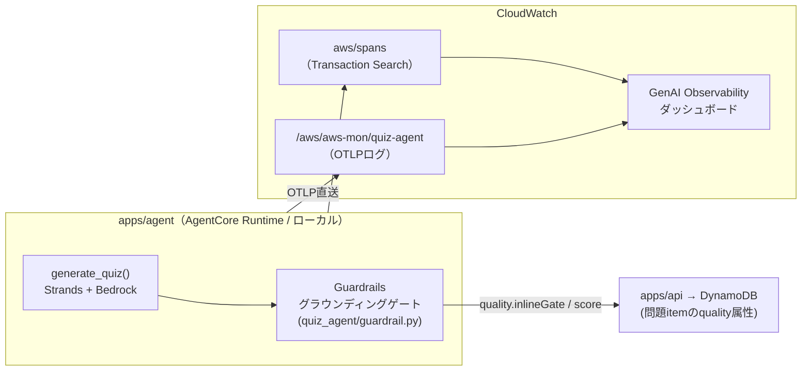

# observability — 監視・オブザーバビリティ構成

最終更新: 2026-08-03

このプロジェクトに実装されている監視の全体像を示す。設計上の意思決定は
[ADR 0007](adr/0007-observability-stack.md)（オンライン評価の廃止は
[ADR 0011](adr/0011-retire-online-evaluations.md)）、AWSサービス3手段の比較調査は
[research/genai-observability-vs-xray.md](research/genai-observability-vs-xray.md) を参照。本書は、
「**何が・どこで・どう監視されているか**」を示す実装リファレンスである。

## 全体像 — 2層の観測 + 1つのインラインゲート

監視対象の中心は問題生成エージェント（`apps/agent`）である。「経路 / 中身」の2層で観測し、
加えて生成時に不良問題を同期的に弾くインラインゲートを持つ。
かつてあった第3層「品質（傾向）＝AgentCore Evaluations オンライン評価」は、費用の95%超が
ジャッジトークンで便益に見合わなかったため廃止した（[ADR 0011](adr/0011-retire-online-evaluations.md)）。

| # | 層 | 使うサービス | 見えるもの | タイミング |
|---|---|---|---|---|
| 1 | 経路 | X-Ray（Transaction Search） | リクエストの流れ・レイテンシ・スパン全量（インデックス100%） | 実行時・常時 |
| 2 | 中身 | CloudWatch 生成AIオブザーバビリティ（GenAI Observability） | トークン消費・プロンプト・MCPツール呼び出し・セッション単位の束ね | 実行時・常時 |
| G | 品質（ゲート） | Bedrock Guardrails 文脈的グラウンディングチェック | 正解＋解説がAWSドキュメント原文に根拠づくか | 生成時・同期・全件 |



## 1. トレース計装（OTel / ADOT SDK 直送）

- `aws-opentelemetry-distro` を `opentelemetry-instrument` 経由で被せて起動する。
  **Collector は使わない**（AgentCore Runtime 外のエージェントでは ADOT Collector が
  サポートされていないため、SDKからCloudWatch OTLPエンドポイントへの直送が唯一のサポート経路）。
- **計装はオプトイン**。通常起動（`python -m quiz_agent.server`）では何も送らず、挙動・依存も変わらない。

| 環境 | 計装の有効化 | 実装 |
|---|---|---|
| ローカル | `./scripts/run_server_otel.sh` で起動したときだけ有効 | `.env` を読み込み `OTEL_*` を設定してから `opentelemetry-instrument` で起動 |
| prod（AgentCore Runtime） | **常時有効** | Terraform が Runtime 環境変数に `AGENT_OBSERVABILITY_ENABLED=true` と `OTEL_*` 一式を注入（`infra/envs/prod/main.tf` の `agent_environment`）。`docker-entrypoint.sh` がこのフラグを見て `opentelemetry-instrument` を被せる |

主な設定値（ローカルは `.env` の `AGENT_OTEL_*` で変更可）:

| 項目 | 既定値 |
|---|---|
| `service.name` | prod: `aws-mon-quiz-agent` / ローカル: `aws-mon-quiz-agent-local`（コンソールでトレースを区別するため分離） |
| ロググループ | `/aws/aws-mon/quiz-agent` |
| ログストリーム | `runtime-logs`（OTLPエクスポータは自動作成しないため事前作成が必要） |
| メトリクス namespace | `aws-mon-agent` |

**セッション相関**: API は agent 呼び出し時に `sessionId` を渡し、agent 側で OTel baggage
`session.id` に載せる（`quiz_agent/server.py` の `_otel_session`）。GenAI Observability は
これでトレースを出題セッション単位に束ねる。

## 2. ログ（CloudWatch Logs）

| ロググループ | 内容 | 管理 |
|---|---|---|
| `aws/spans` | Transaction Search が取り込むX-Rayスパン（構造化ログ、全量インデックス） | `setup_observability.sh` が有効化 |
| `/aws/aws-mon/quiz-agent` | agent の OTLP ログ | Terraform 管理（retention 30日） |
| `/aws/bedrock-agentcore/runtimes/*` | AgentCore Runtime の標準ログ | Runtime が自動作成（IAMで許可） |
| `/aws/lambda/aws-mon-prod-api` / `-worker` | api / worker Lambda の実行ログ | Lambda が自動作成（IAMで許可） |
| `/aws/bedrock-agentcore/evaluations/*` | 廃止済みオンライン評価の過去の結果（16件）。retention 90日で自然消滅させる | 手動（新規書き込みなし） |

## 3. メトリクス（CloudWatch Metrics）

- `aws-mon-agent` — agent の OTLP メトリクス namespace
- `bedrock-agentcore` — AgentCore Runtime の標準メトリクス

（agent 実行ロールは `cloudwatch:PutMetricData` をこの2つの namespace に限定して許可）

## G. インライン品質ゲート（Guardrails 文脈的グラウンディングチェック）

生成した問題を保存する**前**に、正解＋解説がドキュメントに根拠づくかを同期チェックする
（`quiz_agent/guardrail.py`）。観測層が「観測して後から気づく」のに対し、こちらは
「不良品をその場で弾く」役割。**品質担保はこのゲートに一本化**されている（ADR 0011）。

- **入力**: grounding_source = AWSドキュメントMCP調査で取得した公式ドキュメント原文 /
  query = 設問文 / guard content = 正解の選択肢＋解説
- **判定**: `ApplyGuardrail`（bedrock-runtime）。しきい値は grounding 0.6 / relevance 0.5
  （実測分布に基づく再設定の根拠は [ADR 0010](adr/0010-grounding-gate-thresholds.md)）
- **バージョン運用**: DRAFT ではなく発行済みバージョンを `AGENT_GUARDRAIL_VERSION` で固定する。
  prod は `agent_guardrail_version`（Terraform変数、既定 `2`）で注入し、切り戻しは
  `1`（旧しきい値 grounding 0.7）に戻して apply する
- **ブロック時**: 再生成（`AGENT_GUARDRAIL_RETRIES`、既定1回）。それでも通らなければ
  生成失敗（HTTP 422 `grounding_blocked`）
- **fail-open はガードレール呼び出し自体の障害に限る**: `ApplyGuardrail` のエラー（権限・
  リージョンなど）は判定なし（`not_run`）で生成を継続する。ゲートは品質・コストを保護し、可用性を落とさない
- **根拠ゼロは fail-closed**（issue #77）: grounding source が空のままの生成は「無検査で通した」
  状態になるため、ゲート有効かつ `AGENT_GUARDRAIL_ENFORCE=1` では保存させない。原因を3分類する:
  - `research_failed` … 調査ターンがリトライ後も失敗（依存障害。HTTP 502 `research_failed`。
    422 の品質不合格とは区別する）
  - `no_tool_calls` … 調査ターンでツールが1回も呼ばれなかった（HTTP 422 `research_incomplete`）
  - `no_read_documentation` … search のみで成功した `read_documentation` の結果がゼロ
    （HTTP 422 `research_incomplete`）。検索結果スニペットを根拠扱いする旧フォールバックは撤去した
  レポートモード（`ENFORCE=0`）やゲート未設定時は従来どおり生成を返し、`not_run` + 上記の
  `detail` を記録する
- **調査ターンの一過性エラーはリトライ**: ストリーム途中の上流エラー（`status_code` を持たない
  `openai.APIError`）は `AGENT_RESEARCH_RETRIES`（既定2）回まで調査ターンをやり直す
  （試行ごとに新しい Agent、backoff+jitter つき。429 は即時終了でリトライしない）。
  not_run 23% の支配的原因だった（issue #77 のログ解析）
- **文字数上限**: source 10万字 / query 1,000字 / content 5,000字（超過分は切り詰め＝判定対象外）
- `AGENT_GUARDRAIL_ENFORCE=0` でレポートのみモード（しきい値チューニング用）
- **計測**（EMF、namespace `AWSMon/Agent`、`quiz_agent/gate_metrics.py`）: 全結果で
  `GateEvaluationCount=1` を発行し、`Status`（passed / failed / not_run）を dimension に持つ。
  スコアが算出されない `not_run` も CloudWatch Metrics で件数集計できる。理由（上記3分類など）は
  高カーディナリティ化を避けるため dimension にせず、EMF payload の `Reason` フィールドと
  構造化ログ（`grounding_gate` イベントの `detail`）に残す。早期リターン・調査失敗フォールバックを
  含む全経路が同じ計測関数を通る（issue #77 で計測の穴を塞いだ）
- ゲート通過率・スコア分布の傾向は `scripts/sample_gate_scores.py` の手動バッチ計測で確認する
  （JSONL には `detail`、先頭のメタ行に model ID と主要依存バージョンを記録する）

### 再生成回数（`AGENT_GUARDRAIL_RETRIES`）と無料枠のトレードオフ

既定は **1**（初回＋再生成1回）。判断材料:

- **1回の再生成で消費するのは `structured_output` 1リクエストのみ**。調査フェーズ（MCP）は
  やり直さず、調査済みの会話履歴を再利用する（[ADR 0009](adr/0009-openrouter-default-provider.md) 決定4-A）。
  再生成時はブロック理由をフィードバックとして注入し、初回と同じ条件を繰り返さないようにしている
- **初回通過率は 60.9%**（ADR 0010 の実測、grounding 0.6 換算・評価が走った23件中14件）。
  残りを補うために再生成し、この値を「再生成が必要になる頻度」の目安とする
- **無料枠**: OpenRouter は 1,000リクエスト/日（$10クレジット購入済みのアカウント。未購入だと50/日）。
  1問あたりの消費は調査ツール呼び出し＋生成で数リクエスト規模のため、既定の1回では枠が制約にならない
- **0 にする判断**: 枠が逼迫している、または生成失敗（422）よりレイテンシを優先する場合。
  ただし初回で落ちた問題はそのまま失格になる
- **2以上にする判断**: 現時点では推奨しない。再生成の通過率は未実測（ADR 0010 は `RETRIES=0` で
  採取したため）で、回数を増やす根拠がない。prod の `grounding_gate` メトリクス（attempt 別）が
  蓄積されてから再検討する

結果は、問題 item の `quality` 属性として DynamoDB に保存される:

| フィールド | 値 |
|---|---|
| `quality.inlineGate` | `passed` / `failed` / `not_run` |
| `quality.score` | groundingスコア（判定時のみ） |
| `quality.evaluator` | 常に `none`（廃止済みオンライン評価の対象だった過去アイテムには `agentcore_evaluate` が残る） |
| `quality.evaluatedAt` / `quality.issues` | 判定時刻 / 失敗・スキップ理由 |

## セットアップ（一度きり）

```bash
cd apps/agent

# 1. Transaction Search 有効化 + agent用ロググループ/ストリーム作成（要 logs/xray 権限）
./scripts/setup_observability.sh

# 2. グラウンディングチェック用ガードレール作成（表示された guardrailId を控える）
python scripts/create_guardrail.py
#    ローカル: .env の AGENT_GUARDRAIL_ID に設定
#    prod:     SSM /app/aws-mon/prod/agent-guardrail-id に手動登録（Terraformが Runtime に注入）
```

しきい値を変えるときは DRAFT を運用したままにせず、バージョンを発行して固定する:

```bash
# 現行DRAFTをそのまま版として発行（変更前の切り戻し先を確保する）
python scripts/create_guardrail.py --publish

# しきい値を更新して新しい版を発行 → 表示された版番号を
# infra/envs/prod/variables.tf の agent_guardrail_version 既定値（およびローカルは .env）に
# 反映して apply する
python scripts/create_guardrail.py --update --grounding-threshold 0.6 --publish
```

prod では `/aws/aws-mon/quiz-agent` ロググループを Terraform 管理に取り込み済みで、
計装用の環境変数も Terraform が注入するため、デプロイ後の追加作業はない。

## 環境ごとの差分

| | ローカル | prod |
|---|---|---|
| トレース計装 | オプトイン（`run_server_otel.sh`） | 常時有効（Runtime環境変数） |
| グラウンディングゲート | `.env` の `AGENT_GUARDRAIL_ID` 設定時のみ | 常時有効（SSM経由で注入） |
| 自己整合ジャッジ | `.env` の `AGENT_JUDGE_MODEL_ID` 設定時のみ | 同左（未設定なら `not_run`） |
| `service.name` | `aws-mon-quiz-agent-local`（コンソールで prod と区別。`AGENT_OTEL_SERVICE_NAME` で変更可） | `aws-mon-quiz-agent` |
| 観測層の再現 | しない（観測は実AWSのみ。[ADR 0004](adr/0004-local-first-dev.md)） | — |

## 確認方法（コンソール）

- **CloudWatch > GenAI Observability** — トレース（トークン・プロンプト・MCPツール呼び出し）、
  セッション（`session.id` で束ねた一覧）
- **X-Ray Trace Map / Transaction Search** — 経路・レイテンシ・エラーの分布
- **CloudWatch Logs** — 上記ロググループ表を参照

## コスト上の留意点

- Transaction Search はスパンのインデックスに課金（個人利用の低トラフィック前提で全量インデックス）
- グラウンディングチェックは文字数課金。ブロック時の再生成は Bedrock 呼び出しが倍になる
  （リトライ既定1回に抑制）
- かつての最大コスト要因は AgentCore Evaluations のジャッジトークン（AgentCore 費用の95%超、
  1評価 $0.06〜$0.13）だったため廃止した。実測と経緯は
  [ADR 0011](adr/0011-retire-online-evaluations.md)

## 未実装（今後の候補）

- CloudWatch アラーム・通知（エラー率・生成失敗率・コスト超過の能動的アラートは未設定。
  現状はダッシュボードでの受動的確認のみ）
- `ops/`（readonly権限の監視AIによる運用ループ・issue発行）— [ADR 0003](adr/0003-monorepo-and-terraform-envs.md) 参照、未着手
- ダッシュボード定義のコード管理（現状はマネージドのGenAI Observabilityビューをそのまま使用）
