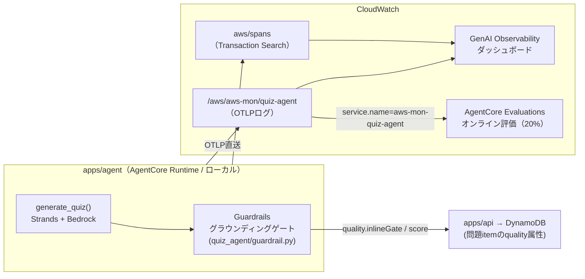

# observability — 監視・オブザーバビリティ構成

最終更新: 2026-07-09

このプロジェクトに実装されている監視の全体像。設計の意思決定は
[ADR 0007](adr/0007-observability-stack.md)、AWSサービス3手段の比較調査は
[research/genai-observability-vs-xray.md](research/genai-observability-vs-xray.md) を参照。
本書は「**何が・どこで・どう監視されているか**」の実装リファレンス。

## 全体像 — 3層の観測 + 1つのインラインゲート

監視対象の中心は問題生成エージェント（`apps/agent`）。「経路 / 中身 / 品質」の3層で観測し、
加えて生成時に不良問題を同期的に弾くインラインゲートを持つ。

| # | 層 | 使うサービス | 見えるもの | タイミング |
|---|---|---|---|---|
| 1 | 経路 | X-Ray（Transaction Search） | リクエストの流れ・レイテンシ・スパン全量（インデックス100%） | 実行時・常時 |
| 2 | 中身 | CloudWatch 生成AIオブザーバビリティ（GenAI Observability） | トークン消費・プロンプト・MCPツール呼び出し・セッション単位の束ね | 実行時・常時 |
| 3 | 品質（傾向） | AgentCore Evaluations オンライン評価 | LLM-as-a-Judge（`Builtin.Correctness`）による採点。サンプリング20% | 非同期・事後 |
| G | 品質（ゲート） | Bedrock Guardrails 文脈的グラウンディングチェック | 正解＋解説がAWSドキュメント原文に根拠づくか | 生成時・同期・全件 |



## 1. トレース計装（OTel / ADOT SDK 直送）

- `aws-opentelemetry-distro` を `opentelemetry-instrument` 経由で被せて起動する。
  **Collector は使わない**（AgentCore Runtime 外のエージェントでは ADOT Collector が
  非サポートのため、SDKからCloudWatch OTLPエンドポイントへの直送が唯一のサポート経路）。
- **計装はオプトイン**。通常起動（`python -m quiz_agent.server`）では何も送らず、挙動・依存も変わらない。

| 環境 | 計装の有効化 | 実装 |
|---|---|---|
| ローカル | `./scripts/run_server_otel.sh` で起動したときだけ有効 | `.env` を読み込み `OTEL_*` を設定してから `opentelemetry-instrument` で起動 |
| prod（AgentCore Runtime） | **常時有効** | Terraform が Runtime 環境変数に `AGENT_OBSERVABILITY_ENABLED=true` と `OTEL_*` 一式を注入（`infra/envs/prod/main.tf` の `agent_environment`）。`docker-entrypoint.sh` がこのフラグを見て `opentelemetry-instrument` を被せる |

主な設定値（ローカルは `.env` の `AGENT_OTEL_*` で変更可）:

| 項目 | 既定値 |
|---|---|
| `service.name` | prod: `aws-mon-quiz-agent` / ローカル: `aws-mon-quiz-agent-local`（オンライン評価の対象から外すため分離） |
| ロググループ | `/aws/aws-mon/quiz-agent` |
| ログストリーム | `runtime-logs`（OTLPエクスポータは自動作成しないため事前作成が必要） |
| メトリクス namespace | `aws-mon-agent` |

**セッション相関**: API は agent 呼び出し時に `sessionId` を渡し、agent 側で OTel baggage
`session.id` に載せる（`quiz_agent/server.py` の `_otel_session`）。GenAI Observability は
これでトレースを出題セッション単位に束ねる。

## 2. ログ（CloudWatch Logs）

| ロググループ | 内容 | 管理 |
|---|---|---|
| `aws/spans` | Transaction Search が取り込むX-Rayスパン（構造化ログ、全量インデックス） | `setup_observability.sh` が有効化 |
| `/aws/aws-mon/quiz-agent` | agent の OTLP ログ。**オンライン評価のデータソースも兼ねる** | Terraform 管理（retention 30日） |
| `/aws/bedrock-agentcore/runtimes/*` | AgentCore Runtime の標準ログ | Runtime が自動作成（IAMで許可） |
| `/aws/lambda/aws-mon-prod-api` / `-worker` | api / worker Lambda の実行ログ | Lambda が自動作成（IAMで許可） |
| `/aws/bedrock-agentcore/evaluations/*` | オンライン評価の結果出力 | 評価実行ロールが書き込み |

## 3. メトリクス（CloudWatch Metrics）

- `aws-mon-agent` — agent の OTLP メトリクス namespace
- `bedrock-agentcore` — AgentCore Runtime の標準メトリクス

（agent 実行ロールは `cloudwatch:PutMetricData` をこの2つの namespace に限定して許可）

## G. インライン品質ゲート（Guardrails 文脈的グラウンディングチェック）

生成した問題を保存する**前**に、正解＋解説がドキュメントに根拠づくかを同期チェックする
（`quiz_agent/guardrail.py`）。監視3層が「観測して後から気づく」のに対し、こちらは
「不良品をその場で弾く」役割。

- **入力**: grounding_source = AWSドキュメントMCP調査で取得した公式ドキュメント原文 /
  query = 設問文 / guard content = 正解の選択肢＋解説
- **判定**: `ApplyGuardrail`（bedrock-runtime）。しきい値は grounding 0.7 / relevance 0.5 起点
  （`scripts/create_guardrail.py`）。実測分布に基づく grounding 0.6 への引き下げを
  [ADR 0010](adr/0010-grounding-gate-thresholds.md) で提案中（未適用）
- **ブロック時**: 再生成（`AGENT_GUARDRAIL_RETRIES`、既定1回）。それでも通らなければ
  生成失敗（HTTP 422 `grounding_blocked`）
- **fail-open**: ガードレール自体の障害や MCP 調査なし生成では判定なし（`not_run`）で生成継続。
  ゲートは品質・コスト保護であり可用性を落とさない
- **文字数上限**: source 10万字 / query 1,000字 / content 5,000字（超過分は切り詰め＝判定対象外）
- `AGENT_GUARDRAIL_ENFORCE=0` でレポートのみモード（しきい値チューニング用）

結果は問題 item の `quality` 属性として DynamoDB に保存される:

| フィールド | 値 |
|---|---|
| `quality.inlineGate` | `passed` / `failed` / `not_run` |
| `quality.score` | groundingスコア（判定時のみ） |
| `quality.evaluator` | `agentcore_evaluate`（計装つき起動＝オンライン評価の対象トレース） / `none` |
| `quality.evaluatedAt` / `quality.issues` | 判定時刻 / 失敗・スキップ理由 |

## 4. オンライン評価（AgentCore Evaluations）

OTel計装で送ったトレースを LLM-as-a-Judge が非同期に採点する（旧 `evaluate_question`
自己批評の置き換え）。設定は `scripts/setup_evaluations.py` が作成・更新する。

- **データソース**: CloudWatchロググループ（`/aws/aws-mon/quiz-agent`）+ `service.name`
  = `aws-mon-quiz-agent`（agent が Runtime 外でも動く前提の方式）。ローカルは
  `aws-mon-quiz-agent-local` を使うため対象外＝開発中の試行にジャッジ課金が乗らない（2026-08-03）
- **評価者**: `Builtin.Correctness` のみ。ドキュメント整合（Faithfulness相当）は上記
  Guardrails ゲートが全件・同期で担保するため、オンライン評価から外した（コスト最適化 2026-07-04）
- **サンプリング**: 20%（品質チューニング時は `--sampling` で一時的に上げる）
- **実行ロール**: `AgentCoreEvaluationRole-aws-mon`（スクリプトが作成。トレース読取 /
  評価結果書込 / spans インデックス / ジャッジモデル呼び出しの最小権限）
- **結果の置き場**: CloudWatch > GenAI Observability の Evaluations のみ。
  DynamoDB へは書き戻さない（ダッシュボードで傾向を見る用途のため）

## セットアップ（一度きり）

```bash
cd apps/agent

# 1. Transaction Search 有効化 + agent用ロググループ/ストリーム作成（要 logs/xray 権限）
./scripts/setup_observability.sh

# 2. グラウンディングチェック用ガードレール作成（表示された guardrailId を控える）
python scripts/create_guardrail.py
#    ローカル: .env の AGENT_GUARDRAIL_ID に設定
#    prod:     SSM /app/aws-mon/prod/agent-guardrail-id に手動登録（Terraformが Runtime に注入）

# 3. オンライン評価設定の作成（同名設定があればサンプリング率・評価者を更新）
python scripts/setup_evaluations.py
```

prod では `/aws/aws-mon/quiz-agent` ロググループを Terraform 管理に取り込み済みで、
計装用の環境変数も Terraform が注入するため、デプロイ後の追加作業はない。

## 環境ごとの差分

| | ローカル | prod |
|---|---|---|
| トレース計装 | オプトイン（`run_server_otel.sh`） | 常時有効（Runtime環境変数） |
| グラウンディングゲート | `.env` の `AGENT_GUARDRAIL_ID` 設定時のみ | 常時有効（SSM経由で注入） |
| オンライン評価 | **対象外**（`service.name` が `-local` のため。評価したいときだけ `AGENT_OTEL_SERVICE_NAME` を prod と揃える） | 全トレースが対象（うち20%を採点） |
| 観測層の再現 | しない（観測は実AWSのみ。[ADR 0004](adr/0004-local-first-dev.md)） | — |

## 確認方法（コンソール）

- **CloudWatch > GenAI Observability** — トレース（トークン・プロンプト・MCPツール呼び出し）、
  セッション（`session.id` で束ねた一覧）、Evaluations（オンライン評価スコアの傾向）
- **X-Ray Trace Map / Transaction Search** — 経路・レイテンシ・エラーの分布
- **CloudWatch Logs** — 上記ロググループ表を参照

## コスト上の留意点

- Transaction Search はスパンのインデックスに課金（個人利用の低トラフィック前提で全量インデックス）
- グラウンディングチェックは文字数課金。ブロック時の再生成は Bedrock 呼び出しが倍になる
  （リトライ既定1回に抑制）
- オンライン評価はジャッジモデルの推論コストがかかるため、サンプリング20%・評価者1つに絞っている

## 未実装（今後の候補）

- CloudWatch アラーム・通知（エラー率・生成失敗率・コスト超過の能動的アラートは未設定。
  現状はダッシュボードでの受動的確認のみ）
- `ops/`（readonly権限の監視AIによる運用ループ・issue発行）— [ADR 0003](adr/0003-monorepo-and-terraform-envs.md) 参照、未着手
- ダッシュボード定義のコード管理（現状はマネージドのGenAI Observabilityビューをそのまま使用）
