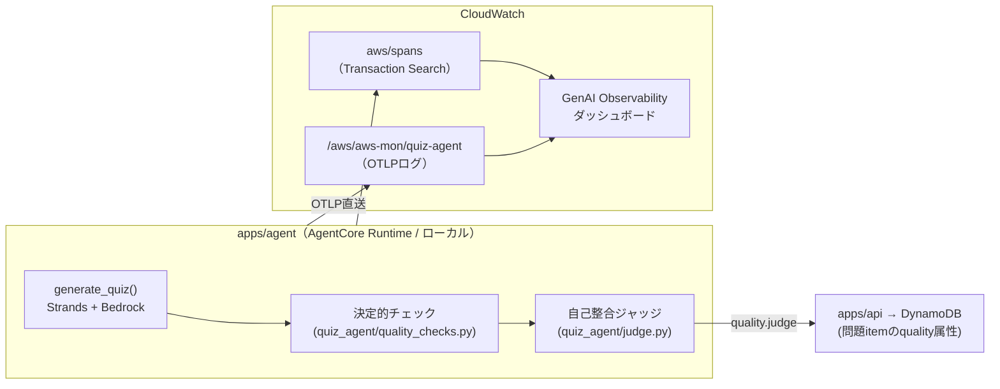

# observability — 監視・オブザーバビリティ構成

最終更新: 2026-08-03

このプロジェクトに実装されている監視の全体像を示す。設計上の意思決定は
[ADR 0007](adr/0007-observability-stack.md)（オンライン評価の廃止は
[ADR 0011](adr/0011-retire-online-evaluations.md)）、AWSサービス3手段の比較調査は
[research/genai-observability-vs-xray.md](research/genai-observability-vs-xray.md) を参照。本書は、
「**何が・どこで・どう監視されているか**」を示す実装リファレンスである。

## 全体像 — 2層の観測 + 保存前の品質チェック

監視対象の中心は問題生成エージェント（`apps/agent`）である。「経路 / 中身」の2層で観測し、
加えて生成時に不良問題を同期的に弾く保存前チェックを持つ。
かつてあった第3層「品質（傾向）＝AgentCore Evaluations オンライン評価」は、費用の95%超が
ジャッジトークンで便益に見合わなかったため廃止した（[ADR 0011](adr/0011-retire-online-evaluations.md)）。
その後継だった Guardrails グラウンディングゲートも、実測で真陽性がゼロだったため
[ADR 0018](adr/0018-retire-grounding-gate-as-quality-judge.md) で撤去した。

| # | 層 | 使うサービス | 見えるもの | タイミング |
|---|---|---|---|---|
| 1 | 経路 | X-Ray（Transaction Search） | リクエストの流れ・レイテンシ・スパン全量（インデックス100%） | 実行時・常時 |
| 2 | 中身 | CloudWatch 生成AIオブザーバビリティ（GenAI Observability） | トークン消費・プロンプト・MCPツール呼び出し・セッション単位の束ね | 実行時・常時 |
| G | 品質（保存前） | 決定的チェック（LLMなし）＋ 自己整合ジャッジ（OpenRouter無料モデル） | 出荷に耐えない構造欠陥・論理欠陥 | 生成時・同期・全件 |



## 1. トレース計装（OTel / ADOT SDK 直送）

- `aws-opentelemetry-distro` を `opentelemetry-instrument` 経由で被せて起動する。
  **Collector は使わない**（AgentCore Runtime 外のエージェントでは ADOT Collector が
  サポートされていないため、SDKからCloudWatch OTLPエンドポイントへの直送が唯一のサポート経路）。
- **計装はオプトイン**。通常起動（`python -m quiz_agent.server`）では何も送らず、挙動・依存も変わらない。

| 環境 | 計装の有効化 | 実装 |
|---|---|---|
| ローカル | `./scripts/run_server_otel.sh` で起動したときだけ有効 | `.env` を読み込み `OTEL_*` を設定してから `opentelemetry-instrument` で起動 |
| prod（AgentCore Runtime） | **常時有効** | Terraform が Runtime 環境変数に `AGENT_OBSERVABILITY_ENABLED=true` と `OTEL_*` 一式を注入（`infra/envs/prod/main.tf` の `agent_environment`）。`docker-entrypoint.sh` がこのフラグを見て `opentelemetry-instrument` を被せる |

主な設定値（ローカルは `.env` の `AGENT_OTEL_*` で変更可）:

| 項目 | 既定値 |
|---|---|
| `service.name` | prod: `aws-mon-quiz-agent` / ローカル: `aws-mon-quiz-agent-local`（コンソールでトレースを区別するため分離） |
| ロググループ | `/aws/aws-mon/quiz-agent` |
| ログストリーム | `runtime-logs`（OTLPエクスポータは自動作成しないため事前作成が必要） |
| メトリクス namespace | `aws-mon-agent` |

**セッション相関**: API は agent 呼び出し時に `sessionId` を渡し、agent 側で OTel baggage
`session.id` に載せる（`quiz_agent/server.py` の `_otel_session`）。GenAI Observability は
これでトレースを出題セッション単位に束ねる。

## 2. ログ（CloudWatch Logs）

| ロググループ | 内容 | 管理 |
|---|---|---|
| `aws/spans` | Transaction Search が取り込むX-Rayスパン（構造化ログ、全量インデックス） | `setup_observability.sh` が有効化 |
| `/aws/aws-mon/quiz-agent` | agent の OTLP ログ | Terraform 管理（retention 30日） |
| `/aws/bedrock-agentcore/runtimes/*` | AgentCore Runtime の標準ログ | Runtime が自動作成（IAMで許可） |
| `/aws/lambda/aws-mon-prod-api` / `-worker` | api / worker Lambda の実行ログ | Lambda が自動作成（IAMで許可） |
| `/aws/bedrock-agentcore/evaluations/*` | 廃止済みオンライン評価の過去の結果（16件）。retention 90日で自然消滅させる | 手動（新規書き込みなし） |

## 3. メトリクス（CloudWatch Metrics）

- `aws-mon-agent` — agent の OTLP メトリクス namespace
- `bedrock-agentcore` — AgentCore Runtime の標準メトリクス

（agent 実行ロールは `cloudwatch:PutMetricData` をこの2つの namespace に限定して許可）

## G. 保存前の品質チェック（決定的チェック → 自己整合ジャッジ）

生成した問題を保存する**前**に、出荷に耐えない問題を同期的に弾く。観測層が
「観測して後から気づく」のに対し、こちらは「不良品をその場で弾く」役割である。

**2026-08-09 に構成を入れ替えた。**それまでの Guardrails 文脈的グラウンディング
チェックは実測で本物の欠陥を1つも捕まえておらず（grounding 軸の真陽性ゼロ、事実誤りの
ある問題は 0.78 / 0.92 で通過）、さらにブロック起因の再生成が良問を壊して壊れた版を
通していた。撤去の根拠と計測は [ADR 0018](adr/0018-retire-grounding-gate-as-quality-judge.md)。

| 層 | 対象 | 手段 | 強制力 |
|---|---|---|---|
| 内容ポリシー | 日本語プレーンテキスト要件（HTML・Markdown・英文混入） | `quiz_agent/content_policy.py` | 再生成1回 → fail-closed |
| 決定的チェック | 構造欠陥（問いかけ欠落＝回答不能・カタカナ退化・選択肢ラベル重複・URLエンコード混入） | `quiz_agent/quality_checks.py`。LLM呼び出しなし | 再生成1回 → fail-closed |
| 自己整合ジャッジ | 論理欠陥（設問要件と正解の矛盾、選択肢の固有名を解説が裏付けない、正解の一意性、正解ラベルと解説の食い違い） | `quiz_agent/judge.py`。OpenRouter 無料モデル | **report-only**（保存するだけ） |

### 決定的チェックと内容ポリシー

- どちらも保存前に適用し、違反したら**欠陥を名指しした指示**で構造化出力だけを再生成する
  （`AGENT_CONTENT_RETRIES`、既定1回）。解消しなければ HTTP 422 `content_invalid` で
  fail-closed とし、問題バンクへ保存しない
- 汎用的な「作り直してください」にはしない。ADR 0018 の計測で、汎用指示は設問のシナリオ
  （状況設定・要件・症状）を削って回答不能な問題にすることが分かっている
- 決定的チェックの判定条件は**生成パスに繋ぐ前に実データ全件へ当てて誤検出率を測る**こと。
  `scripts/check_quality_defects.py` がその用途である

### 自己整合ジャッジ

- **入力は QuizItem の利用者向けフィールドだけ**（設問・選択肢・正解ラベル・解説）。
  参照URLは渡さない（原文を読ませない以上、判定材料にならないため）
- **事実確認と難易度は判定しない。**事実確認は英語原文を読ませる必要があり、
  [ADR 0011](adr/0011-retire-online-evaluations.md) が費用で廃止した経路の再来になる
- 判定は verdict だけでなく**欠陥型と理由**を返す。欠陥特定型の再生成を可能にするため
- モデルIDは `AGENT_JUDGE_MODEL_ID` で解決する。**未設定ならジャッジは動かない**（`not_run`）。
  無料モデルは予告なく消えるため切り戻せるようにしてある。生成モデルと同じIDを設定すると
  自己批評になるため警告を出す（ADR 0007 が一度実装して削除した経路）
- ジャッジ自体の障害（モデル未提供・429・構造化出力が返らない）では生成物を捨てない
  （fail-open、`status=error`）。判定はすでに出来上がった問題に対して走るため
- **強制力は段階的に上げる。**較正セットは合成負例であり実トラフィックでの精度を保証しない
  ため、まず report-only で分布を採る（[ADR 0010](adr/0010-grounding-gate-thresholds.md) と同じ手順）
- 候補モデルの選定は `scripts/run_judge_calibration.py`（較正セット
  `tests/fixtures/judge_calibration.json`、clean 3 + defective 9）で行う

### 調査の完了は fail-closed（issue #77）

調査（AWSドキュメントMCP）が失敗したまま生成すると、本当に根拠のない問題ができる。
これはゲート撤去後も維持する。**撤去前は `AGENT_GUARDRAIL_ENFORCE` がこの制御を兼ねており、
`AGENT_GUARDRAIL_ID` が未設定だと fail-closed 自体が効かなかった。**ガードレールの設定と
調査の強制は無関係なので、`AGENT_RESEARCH_ENFORCE`（既定1）に切り離した。

| status | 意味 | 強制時の応答 |
|---|---|---|
| `complete` | `read_documentation` の原文を取得できた | — |
| `incomplete` | ツールを1回も呼ばなかった（`no_tool_calls`）/ search のみで `read_documentation` の結果がゼロ（`no_read_documentation`） | HTTP 422 `research_incomplete` |
| `failed` | 調査ターンがリトライ後も依存障害で完了しなかった | HTTP 502 `research_failed`（422 の品質不合格と区別する） |
| `skipped` | `AGENT_DOCS_MCP=0` で調査自体を行わなかった | — |

- **調査ターンの一過性エラーはリトライ**: ストリーム途中の上流エラー（`status_code` を持たない
  `openai.APIError`）は `AGENT_RESEARCH_RETRIES`（既定2）回まで調査ターンをやり直す
  （試行ごとに新しい Agent、backoff+jitter つき。429 は即時終了でリトライしない）。
  かつての not_run 23% の支配的原因だった（issue #77 のログ解析）
- `AGENT_RESEARCH_ENFORCE=0` にすると調査未完了でも生成を返す（記録は残る）

### 計測

EMF（namespace `AWSMon/Agent`、`quiz_agent/research_metrics.py`）で全生成に
`ResearchCount=1` を発行し、`Status`（complete / incomplete / failed / skipped）を
dimension に持つ。理由は高カーディナリティ化を避けるため dimension にせず、EMF payload の
`Reason` と構造化ログ（`research_completeness` イベントの `detail`）に残す。早期リターン・
調査失敗フォールバックを含む全経路が同じ計測関数を通る（issue #77 で計測の穴を塞いだ）。

**ゲート撤去に伴い `GateEvaluationCount` / `GroundingScore` / `RelevanceScore` は
発行されなくなった。**ダッシュボードは `ResearchCount` に差し替えること。

ジャッジ判定と決定的チェックの発生状況は構造化ログで追う。

| イベント | 内容 |
|---|---|
| `research_completeness` | 調査の完了状況（status / detail） |
| `quality_defect` | 決定的チェックが検出した欠陥（codes / attempt） |
| `self_consistency_judge` | ジャッジの判定（status / types / model_id） |

傾向は `scripts/sample_generations.py` の手動バッチ計測で確認する（旧
`sample_gate_scores.py`。JSONL には生成された問題本文と調査原文も保存する）。

結果は、問題 item の `quality` 属性として DynamoDB に保存される:

| フィールド | 値 |
|---|---|
| `quality.judge.status` | `clean` / `defective` |
| `quality.judge.defectTypes` | 検出した欠陥型の配列 |
| `quality.judge.modelId` / `quality.judge.detail` | 判定に使ったモデル / 判定理由 |
| `quality.evaluatedAt` | 判定時刻（ジャッジが判定できたときのみ） |
| `quality.inlineGate` | **後方互換のみ。**新規保存は常に `not_run`（既存アイテムに `passed` / `failed` が残る） |
| `quality.score` / `quality.issues` | **後方互換のみ。**新規保存では付かない（既存アイテムに grounding スコアが残る） |
| `quality.evaluator` | 常に `none`（廃止済みオンライン評価の対象だった過去アイテムには `agentcore_evaluate` が残る） |

## セットアップ（一度きり）

```bash
cd apps/agent

# 1. Transaction Search 有効化 + agent用ロググループ/ストリーム作成（要 logs/xray 権限）
./scripts/setup_observability.sh

# 2. 自己整合ジャッジを使う場合はモデルIDを設定する（未設定ならジャッジは動かない）
#    ローカル: .env の AGENT_JUDGE_MODEL_ID
#    prod:     Terraform 変数 agent_judge_model_id
```

**Guardrails のセットアップは不要になった。**[ADR 0018](adr/0018-retire-grounding-gate-as-quality-judge.md)
でグラウンディングゲートを撤去したため、agent は `ApplyGuardrail` を呼ばない。
`scripts/create_guardrail.py` と既存の Guardrails リソース（SSM
`/app/aws-mon/prod/agent-guardrail-id`）は、方針が変わったときのために残してあるが、
生成パスからは参照されていない。Terraform も注入・IAM許可ともに削除済みである
（リソース自体は削除していないので、必要になれば変数と env の再追加だけで戻せる）。

prod では `/aws/aws-mon/quiz-agent` ロググループを Terraform 管理に取り込み済みで、
計装用の環境変数も Terraform が注入するため、デプロイ後の追加作業はない。

## 環境ごとの差分

| | ローカル | prod |
|---|---|---|
| トレース計装 | オプトイン（`run_server_otel.sh`） | 常時有効（Runtime環境変数） |
| 決定的品質チェック | 常時有効（fail-closed） | 同左 |
| 自己整合ジャッジ | `.env` の `AGENT_JUDGE_MODEL_ID` 設定時のみ | Terraform 変数 `agent_judge_model_id`（未設定なら `not_run`） |
| 調査の fail-closed | `AGENT_RESEARCH_ENFORCE`（既定1） | 同左 |
| `service.name` | `aws-mon-quiz-agent-local`（コンソールで prod と区別。`AGENT_OTEL_SERVICE_NAME` で変更可） | `aws-mon-quiz-agent` |
| 観測層の再現 | しない（観測は実AWSのみ。[ADR 0004](adr/0004-local-first-dev.md)） | — |

## 確認方法（コンソール）

- **CloudWatch > GenAI Observability** — トレース（トークン・プロンプト・MCPツール呼び出し）、
  セッション（`session.id` で束ねた一覧）
- **X-Ray Trace Map / Transaction Search** — 経路・レイテンシ・エラーの分布
- **CloudWatch Logs** — 上記ロググループ表を参照

## コスト上の留意点

- Transaction Search はスパンのインデックスに課金（個人利用の低トラフィック前提で全量インデックス）
- グラウンディングチェック（Bedrock Guardrails、文字数課金）は ADR 0018 の撤去でゼロになった
- 自己整合ジャッジは OpenRouter 無料モデルで、生成1問あたり1リクエスト増える。OpenRouter の
  枠は 20 req/分・1,000 req/日で、生成1問あたり通常4〜5リクエストのため制約にならない
- かつての最大コスト要因は AgentCore Evaluations のジャッジトークン（AgentCore 費用の95%超、
  1評価 $0.06〜$0.13）だったため廃止した。実測と経緯は
  [ADR 0011](adr/0011-retire-online-evaluations.md)

## 未実装（今後の候補）

- CloudWatch アラーム・通知（エラー率・生成失敗率・コスト超過の能動的アラートは未設定。
  現状はダッシュボードでの受動的確認のみ）
- `ops/`（readonly権限の監視AIによる運用ループ・issue発行）— [ADR 0003](adr/0003-monorepo-and-terraform-envs.md) 参照、未着手
- ダッシュボード定義のコード管理（現状はマネージドのGenAI Observabilityビューをそのまま使用）
